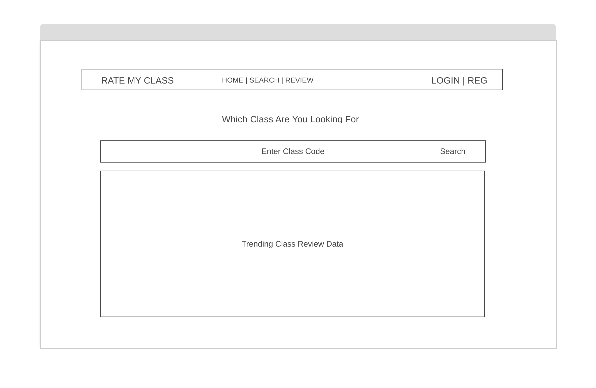
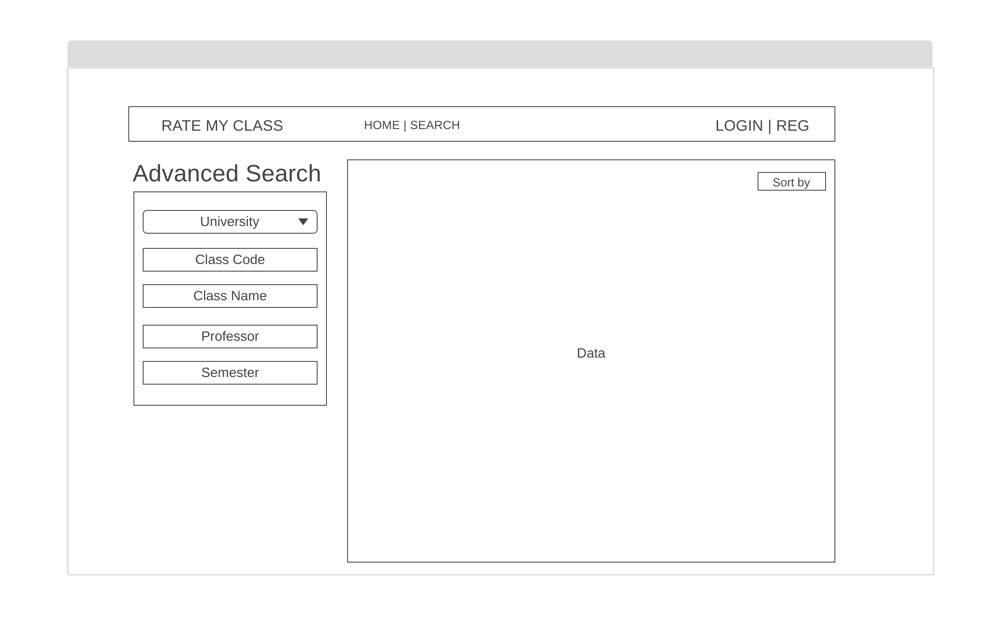
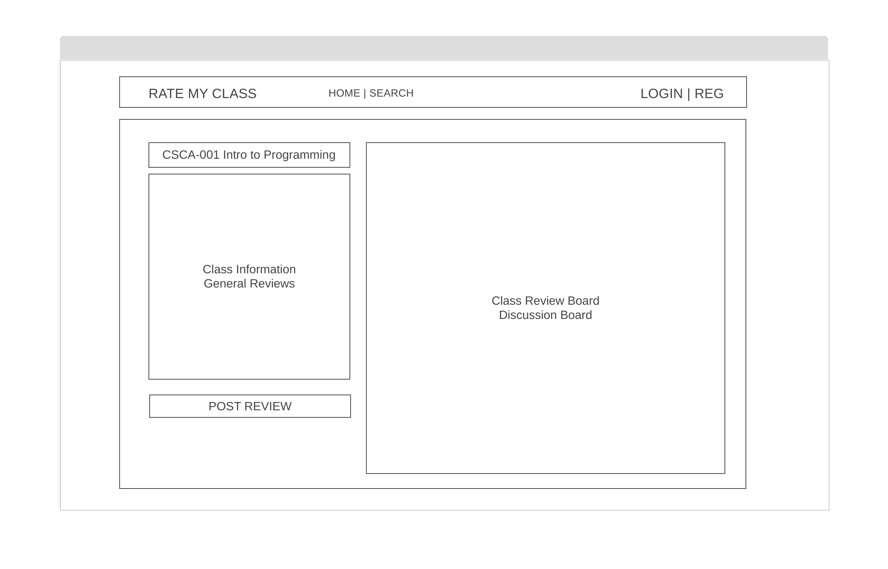
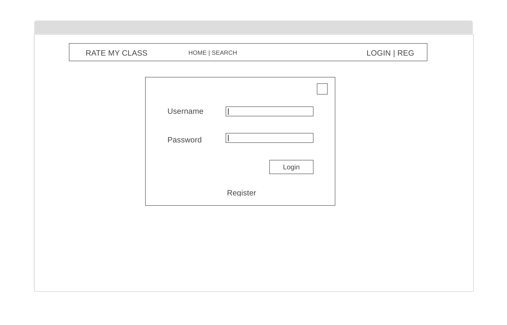
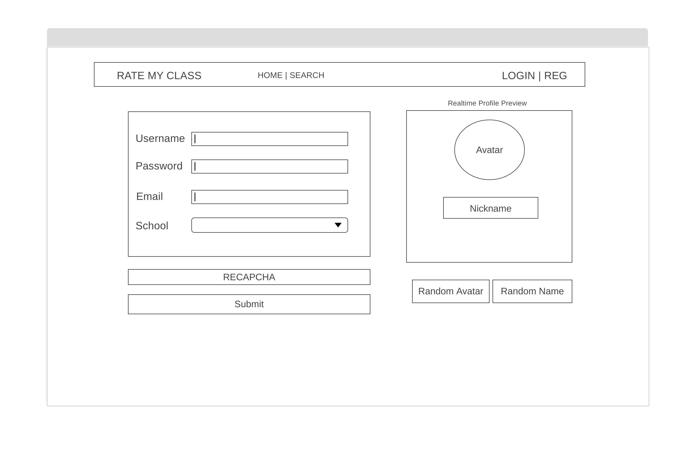
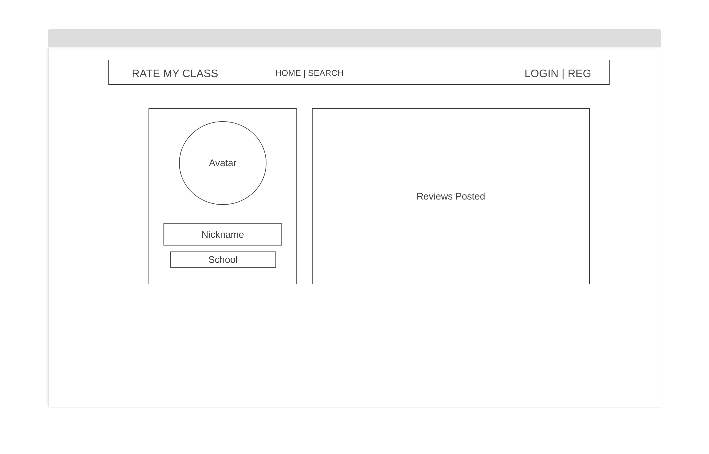
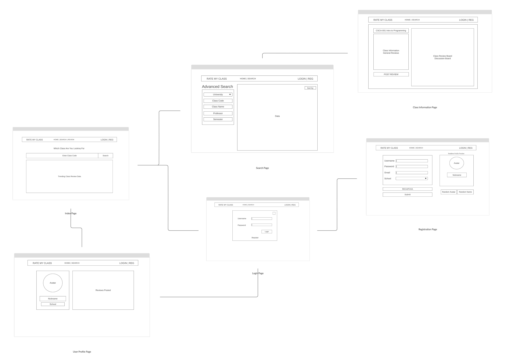

#	Hippo-Rate-My-Class

An Advanced University Class Rating System

Author: @yulonghe97


#####	The following is a first proposal written on 2020-March-31

### Overview

---

Hippo RMC is an advanced class rating system similar to ratemyprofessor.com. However, it is focused on the class rating instead of the individual professor rating. It provides a lots of features that allows student to compare the quality of class within an university based on student review, general grading criteria, as well as popularity scores, etc. It will tell you which class is on trend, which class has the best quality, and some analysis of the class. 

##### P.S: 

(I'dont know how did i come up the name hippo, maybe because I like the animal)

This is a very complicated system. I am not sure if I am able to finsh all the funtionalities before final. But I will work on it and deploy it afterwards.

### Features

---

* Search, Filter for the class (a built-in search engine)

  * can be search by university, semester, professor, class code, class name, department (maybe)

* Class Rating based on

  * student reviews
  * grading
  * popularity
  * stars

* Detailed Page for each class rating

  * professors who teach it
  * reviews, grading, etc.

* Login / Registration User System

  * We will assign a random animal avatar (or maybe a name) for anonymity
  * User are able to follow the class to get updated information
  * Secured Login System
  * RECAPTCHA?

* post/delete review for the class

  * review, grade, professor, quality, difficulty, mood, tags, etc.
    * 'tag' features provides a range of tags that user are able to choose or create (will consider based on time)

* A Beautiful UI 

* #### More advanced Features (possible to build but will consider if time permitted)

  * Data Scrapping and build-in API
    * It will take some data from rate-my-professor, reformat into our class objects and present the information based on class rating instead of professor rating.
    * type in the specific RMP url will present a table clearly shows the reviews and provides some functions easily for student to compare specific class
    * Maybe able to integrate to our own database (but with reference to RMP datasource)
  * Administration Panel
    * A simple administration panel that allows us to manage the site more easily
      * User Mangagement
      * Reviews Management
      * Tags Managment
      * Class Management
      * etc.
  * Graph Representation of Data
  * Advanced Text-editor allows user to upload multi-media for the reviews
  * Auto-Complete when searching


### Data Model

---

The system will have Class, Reviews, User, University, Adminstration as class objects


#### Class

```javascript
{
  className: "Intro to Programming",	
  classCode: "CSCI-001",	
  classSemester:"fall"	
  classID: "cid00000001",	
  classUniversity:{UNIVERSITY},
  classImages, [IMAGE]		// Optional
  professor: "Mr.Batman",
  dateCreated: "2020-03-01",
  overallClassQualityRate: 10.0,
  overallClassDifficultyRate: 8.0,
  overallGrade: "A",
  popularity: 1023
  reviews: [{Review}]	// Array of Review Objects
}
```


#### Review

```javascript
{
  reviewID: "rid00000001",
  reviewUser: {User},
  reviewDate: "2020-03-01-10:00:00PM",
  reviewClass: {Class},
  qualityRating: 5.0,
  difficultyRating: 2.0,
  sentiment: "AWESOME",
  tags: ["HILARIOUS", "AMAZING LECTURES"],
  reviewContent:"Nice Class. I enjoyed with Prof. Batman."
}
```


#### User

```javascript
{
  username:"superman",
  userID: "uid00000001"
  password:"blablabla",
  userEmail: "superman@nyu.edu",
  userNickName: "Moongoose",
  userUniversity: {University},
  userDateCreated: "2020-02-29-02:00:00AM",
  userAvatarUrl:"http://rmc.io/avatar/moongoose.png"
  followedClass: [{Class}],
	reviews: [{Review}],
}
```


#####	University

```javascript
{
  universityID:"uid00000001",
  universityName:"New York University",
  universityAbbr:"NYU",
  universityDateCreated:"2020-03-01",
  universityClasses:[{Class}],
  universityUsers:[{Users}],
}
```


##### Administration (possible to do if time permitted)

```javascript
{
  adminID:"aid001",
  adminUsername:"admin",
  adminPassword:"blablabla",
  adminName:"Yulong",
  userManage: true,
  reviewManage: true,
  tagsManage: true,
  classManage: true,
  universityManage: false
}
```


### [Link to Commented First Draft Schema](https://github.com/nyu-csci-ua-0480-008-spring-2020/yulonghe97-final-project/blob/cb7180878670c884e2d1347a1f9a8f13d9b5ed7e/src/db.js#L1)


### Wirframes

---

/ (index page) - Index Page



/search - Advance Search Page



/class - Class Info Page



/userlogin - User Login Page



/reg - User Registration Page



/user - User Profile Page



#### Sitemap




### User Cases

---

1. as a non-registered user, user is able to search and view the reviews on each class
2. as a non-registered user, user is able to view the class page
3. as a registered user, user is able to post review and follow any classes
4. as a registered user, user will have a profile page that shows the reviews he or she posted.
5. as a registered user, user will have a random generated name and avatar
6. as a registered user, user may use our data scrapping tool (maybe)

### Research Topics

----

* See Below

### [Link to Initial Main Project File](https://github.com/nyu-csci-ua-0480-008-spring-2020/yulonghe97-final-project/blob/ee1b9544c20b25edcb85375ec964bed372d6e60f/src/app.js#L1)

### Annotations / References Used

---

1. [bootstrap](https://getbootstrap.com/docs/4.4/getting-started/introduction/)

2. [jQuery](https://api.jquery.com/)

3. [Passport.js](http://www.passportjs.org/docs/)

4. [reCAPTCHA](https://developers.google.com/recaptcha/docs/display)

5. [Webpack](https://webpack.js.org/concepts/)

   

#### Features Completed

---

#####	Login / Registration

|         Feature         |    Date    |                      Description                       |
| :---------------------: | :--------: | :----------------------------------------------------: |
| Basic Registration Form | 2020-04-05 |           Material Registration form design            |
|     Profile Preview     | 2020-04-05 |            Realtime preview of user profile            |
|   Random Avatar/Image   | 2020-04-06 |   RESTful API-based Random Avatar/Username Generator   |
|     Form Validation     | 2020-04-07 | Check username duplicates. Handle some database error. |
|    School Selection     | 2020-04-06 | Search and Select school using JS during registration  |
|    Password Hashing     | 2020-04-07 |             Password hashing using bycrpt              |

... TO BE UPDATED


### Final Project Checklist

---

- [x] minimum 3 x forms or ajax interactions (**excluding login**)
  - [x] AJAX Search Form
  - [x] Add Class Form
  - [x] Add Review Form
- [x] minimum 3 x Original Higher Order Functions
  - [x] addClass()
  - [x] SearchClass()
  - [x] regUser()
- [x] minimun 2 x mongoose schemas
- [x] stability / security
- [x] originality
- [x] research topics
  - [x] 2 pts - Bootstrap with customized theme
  - [x] 3 pts - Client Side validation using AJAX and jQuery (Review + Register + Class Form)
  - [x] 5 pts - Passport.js 
  - [x] 2 pt -  Fuzzy Search 
  - [x] 1 pt - Image-downloader
  - [x] 1 pt - External API - Random Avatar from DiceBear.com
  - [x] 1 pt - Chart.js, Typeit.js
  - [x] 1 pt - Quill.js Text Editor